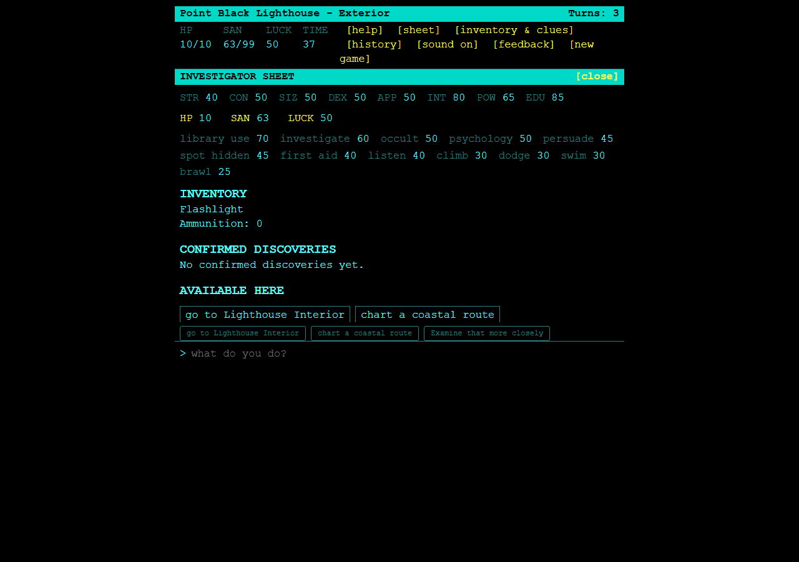

# The Lighthouse — Solo Horror RPG with an AI Dungeon Master

**A browser-based cosmic horror text adventure. Investigate a missing lighthouse keeper, follow unsettling clues, and decide how far you will go to uncover the truth.**

## Play now

**[Enter the lighthouse — play in your browser](https://lighthouse-cthulhu.fly.dev/)**

No download, account, or personal API key is required to play the hosted game. Open it on desktop or mobile, create an investigator, and describe your first action. The web adventure is currently in English.

The story unfolds through an AI Dungeon Master, called the Keeper. Your choices shape the investigation, while the game engine handles dice, inventory, health, sanity, and progression. Free-form narration meets an authored mystery with concrete rules and consequences.



## How to play

1. **Create your investigator.** Choose a name and archetype, then enter Point Black Lighthouse on the Maine coast.
2. **Describe what you attempt.** Try `I listen to the wind outside` or examine your surroundings. When the game requests a skill check, roll the dice in the interface.
3. **Follow the evidence.** Open **Inventory & Clues** to review what you carry, confirmed discoveries, and available commands. Use those commands to move, investigate, and collect items.

Type `inventory` or `inventario` to open your sheet without spending a turn. Reloading the page in the same browser restores your saved session, including a pending roll.

A description is an attempt: saying you found a key or rolled a success does not make it true. The engine checks routes, items, discoveries, and ending requirements. Watch your remaining time, health, and sanity.

## What makes this AI text adventure different?

- **Solo cosmic horror:** an atmospheric lighthouse mystery inspired by Call of Cthulhu 7e mechanics.
- **Free-form actions:** write what you want to try instead of choosing every interaction from a fixed menu.
- **Rules that hold:** server-resolved dice, finite rewards, gated locations, and explicit inventory changes.
- **Consequential endings:** escape, seal the threat, or destroy its foothold when you meet the requirements; injury and madness can also end an investigation.
- **A persistent investigator:** saved progress, a clue journal, inventory, and ammunition tracking.
- **Desktop and mobile play:** a responsive web interface with streamed turn events and clickable dice.
- **Run it yourself:** use a local Ollama model or configure an OpenAI-compatible model endpoint.

The project is under active development. Narration quality and response time depend on the model. Output checks catch known problems, but cannot guarantee that every sentence is free of contradictions.

## Does it have an installer?

There is **no standalone Windows or macOS installer** yet. The easiest way to play is the [hosted browser game](https://lighthouse-cthulhu.fly.dev/).

For local use, follow the Python setup below. The repository also includes a macOS `launch.command` helper; it is a launcher for an already configured environment, not an installer.

## Run the RPG locally

You need **Python 3.11 or newer**, Git, and a running model backend. PostgreSQL is optional; local saves use JSON by default.

### 1. Clone and install dependencies

```bash
git clone https://github.com/Adrian-Sandwich/Cthulhu-generative-RPG.git
cd Cthulhu-generative-RPG
```

**Windows PowerShell**

```powershell
py -3 -m venv .venv
.\.venv\Scripts\python.exe -m pip install -r requirements.txt
```

**macOS / Linux**

```bash
python3 -m venv .venv
source .venv/bin/activate
python -m pip install -r requirements.txt
```

### 2. Choose a model backend

For local inference, install and start [Ollama](https://ollama.com/), then download a model. This small model is an example used in local smoke tests, not a guarantee of narrative quality:

```bash
ollama pull qwen2.5:3b
```

Set the exact model name and start the web app in the same terminal.

**Windows PowerShell**

```powershell
$env:LLM_PROVIDER = 'ollama'
$env:LLM_MODEL = 'qwen2.5:3b'
.\.venv\Scripts\python.exe app.py
```

**macOS / Linux**

```bash
export LLM_PROVIDER=ollama
export LLM_MODEL=qwen2.5:3b
python app.py
```

Open **[localhost:5000](http://127.0.0.1:5000)**. Keep Ollama and the app running while you play.

For a hosted model, configure `LLM_PROVIDER=openai`, `LLM_BASE_URL`, `LLM_MODEL`, and `LLM_API_KEY` instead. The provider name selects the OpenAI-compatible protocol. See [.env.example](.env.example) for supported settings. **Export variables in your shell or configure them on your host: `app.py` does not automatically read `.env`.**

### 3. Deploy or extend the adventure

Use the [deployment guide](docs/DEPLOY.md) for production hosting, secrets, storage, and multiple workers. Adventure content lives in [the Point Black configuration](adventures/point_black/config.json).

| Want to work on… | Start here |
| --- | --- |
| Narrator boundaries and anti-cheating | [Dungeon Master guardrails](docs/DM_GUARDRAILS.md) |
| Movement, items, and discoveries | [World rules](docs/WORLD_RULES.md) |
| Ending requirements | [Ending rules](docs/ENDING_RULES.md) |
| Real-model playtesting | [Live playtest guide](docs/LIVE_PLAYTEST.md) |
| Capacity and performance | [Load testing](docs/LOAD_TESTING.md) and [observability](docs/OBSERVABILITY.md) |
| Release verification | [September 2026 release evidence](docs/reports/release-readiness-20260925/README.md) |
| Known engineering work | [Technical debt](docs/TECH_DEBT.md) |

## Help improve the game

**Play a session and tell us where the mystery stops making sense.** Unexpected narration, confusing commands, broken continuity, or an unclear next step are useful reports.

[Report a bug or suggest an improvement](https://github.com/Adrian-Sandwich/Cthulhu-generative-RPG/issues). Include your action, what happened, and what you expected. Please leave out API keys, cookies, and private save data.

For development, install `requirements-dev.txt` and run `python -m pytest -q`. Frontend checks require Node.js; PostgreSQL integration tests additionally require `CTHULHU_TEST_DATABASE_URL` pointing to a dedicated test database. CI covers Python tests, frontend checks, static attribute checks, and PostgreSQL integration.

This is an independent project, not an official Call of Cthulhu product.

**[Ready to investigate? Play The Lighthouse.](https://lighthouse-cthulhu.fly.dev/)**
